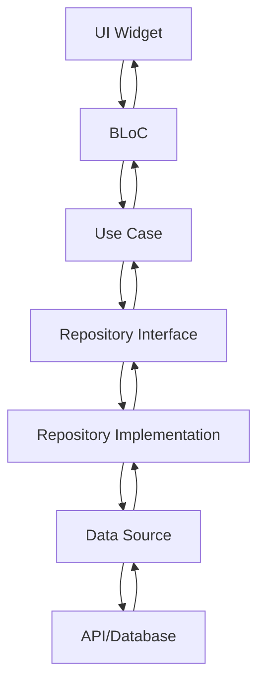

# 🏗️ Project Architecture

## 📁 Project Structure

```
flutter-poc/
├── 📱 android/                 # Android platform code
├── 🍎 ios/                     # iOS platform code
├── 📦 packages/                # Reusable packages
│   ├── style_module/           # UI components & themes
│   └── native_module/          # Native integrations
├── 🎯 lib/                     # Main application code
│   ├── config/                 # App configuration
│   ├── core/                   # Core utilities & DI
│   ├── data/                   # Data layer
│   ├── domain/                 # Business logic
│   ├── presentation/           # UI layer
│   └── utils/                  # Helper utilities
├── 🎨 assets/                  # Static assets
├── 🔧 scripts/                 # Build & development scripts
└── 🧪 test/                    # Test files
```

## 🏛️ Clean Architecture Layers

### 📊 **Presentation Layer** (`lib/presentation/`)

- **Pages**: Screen implementations
- **Widgets**: Reusable UI components
- **BLoC**: State management
- **Router**: Navigation logic

### 🏢 **Domain Layer** (`lib/domain/`)

- **Entities**: Business objects
- **Use Cases**: Business logic
- **Repositories**: Abstract data contracts

### 💾 **Data Layer** (`lib/data/`)

- **Models**: Data transfer objects
- **Repositories**: Repository implementations
- **Data Sources**: API & local data access

### ⚙️ **Core Layer** (`lib/core/`)

- **DI**: Dependency injection setup
- **Network**: HTTP client configuration
- **Router**: App routing configuration
- **Utils**: Core utilities

## 📦 Package Architecture

### 🎨 **style_module**

```
packages/style_module/
├── lib/
│   ├── theme/              # App themes & colors
│   ├── widgets/            # Reusable UI components
│   └── utils/              # Style utilities
└── assets/                 # Style-related assets
```

**Purpose**: Centralized styling and UI components
**Dependencies**: Minimal, Flutter SDK only

### 🔧 **native_module**

```
packages/native_module/
├── lib/                    # Dart interface
├── android/                # Android implementation
└── ios/                    # iOS implementation
```

**Purpose**: Native platform integrations
**Dependencies**: Platform-specific SDKs

## 🔄 Data Flow



## 🎯 Design Patterns

### 🏗️ **Repository Pattern**

- Abstract data access
- Swap implementations easily
- Testable data layer

### 🔄 **BLoC Pattern**

- Reactive state management
- Separation of business logic
- Testable UI logic

### 💉 **Dependency Injection**

- Loose coupling
- Easy testing
- Configuration management

### 📦 **Package Pattern**

- Modular architecture
- Reusable components
- Clear boundaries

## 🚀 Benefits of New Structure

### ✅ **Advantages**

1. **Clear Separation**: Packages have defined responsibilities
2. **Reusability**: Packages can be reused across projects
3. **Maintainability**: Easier to maintain and update
4. **Scalability**: Easy to add new packages
5. **Testing**: Each package can be tested independently
6. **Team Development**: Teams can work on different packages

### 📈 **Scalability**

- Add new packages in `packages/` directory
- Each package maintains its own version
- Independent development cycles
- Clear API boundaries

### 🧪 **Testing Strategy**

- Unit tests for each package
- Integration tests for main app
- Widget tests for UI components
- End-to-end tests for user flows

## 🔧 Development Workflow

### 📦 **Package Development**

```bash
# Work on style module
cd packages/style_module
flutter pub get
flutter test

# Work on native module
cd packages/native_module
flutter pub get
flutter test
```

### 🏗️ **Main App Development**

```bash
# Main app development
flutter pub get
flutter run
flutter test
```

### 🔄 **Package Updates**

1. Update package version in `pubspec.yaml`
2. Update CHANGELOG.md
3. Test package independently
4. Update main app dependency if needed

## 📚 Best Practices

### 🎯 **Package Design**

- Single responsibility principle
- Minimal external dependencies
- Clear public API
- Comprehensive documentation

### 🔗 **Dependencies**

- Avoid circular dependencies
- Use interfaces for communication
- Keep packages loosely coupled

### 📖 **Documentation**

- Document all public APIs
- Provide usage examples
- Maintain CHANGELOG.md
- Write clear README files

### 🧪 **Testing**

- Test all public functionality
- Mock external dependencies
- Write integration tests
- Maintain high test coverage
