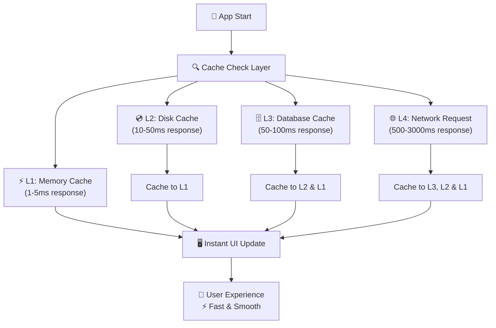

# Flutter Asset Cache Workflow Strategy - Chi tiết Cơ chế Cache từ Lần Thứ 2

> **🎯 Mục tiêu**: Thiết kế workflow cache asset toàn diện để app load nhanh hơn, mượt hơn từ lần thứ 2 trở đi

## 🚀 **Tổng Quan Chiến Lược Cache**

### **Performance Target từ Lần Thứ 2:**

- ⚡ **Giảm 80-90% network requests**
- 🚀 **Tăng 3-5x tốc độ load page**
- 💾 **Giảm 60% memory allocation**
- 🔄 **Smooth scrolling & instant navigation**

## 📊 **Multi-Layer Cache Architecture**



## 🎯 **Workflow Chi Tiết theo Loại Asset**

### **1. Image Assets Workflow**

```dart
class ImageCacheWorkflow {
  // Cấu hình cache tối ưu cho images
  static CacheManager get imageCache => CacheManager(
    Config(
      'optimized_images',
      stalePeriod: const Duration(days: 30),  // Lâu hơn cho images
      maxNrOfCacheObjects: 2000,              // Nhiều objects
      repo: JsonCacheInfoRepository(
        databaseName: 'image_cache_db'
      ),
    ),
  );

  // Preload images quan trọng
  static Future<void> preloadCriticalImages() async {
    final criticalImages = [
      'https://api.app.com/user/avatar',
      'https://api.app.com/app/logo',
      'https://api.app.com/images/placeholder',
    ];

    for (String url in criticalImages) {
      imageCache.downloadFile(url);
    }
  }

  // Load image với fallback strategy
  static Widget buildOptimizedImage({
    required String imageUrl,
    Widget? placeholder,
    Widget? errorWidget,
  }) {
    return CachedNetworkImage(
      imageUrl: imageUrl,
      cacheManager: imageCache,

      // Memory cache configuration
      memCacheWidth: 800,  // Tối ưu memory
      memCacheHeight: 600,

      // Cache key để tránh duplicate
      cacheKey: _generateCacheKey(imageUrl),

      // Placeholder từ cache hoặc local
      placeholder: (context, url) =>
          _getPlaceholderFromCache() ?? placeholder,

      // Error widget với retry
      errorWidget: (context, url, error) =>
          _buildErrorWithRetry(url, error),

      // Fade in animation cho UX mượt
      fadeInDuration: const Duration(milliseconds: 200),
      fadeOutDuration: const Duration(milliseconds: 100),
    );
  }

  // Cache key thông minh
  static String _generateCacheKey(String url) {
    return '${url}_${DateTime.now().millisecondsSinceEpoch ~/ 86400000}';
  }
}
```

### **2. API Data Cache Workflow**

```dart
class ApiDataCacheWorkflow {
  // Cấu hình cache cho API data
  static final Dio _dio = Dio();

  static void initialize() {
    _dio.interceptors.add(
      DioCacheInterceptor(
        options: CacheOptions(
          store: DbCacheStore(
            databasePath: await _getDatabasePath(),
            databaseName: 'api_cache',
          ),

          // Chính sách cache thông minh
          policy: CachePolicy.request,
          hitCacheOnErrorExcept: [401, 403, 500],
          maxStale: const Duration(hours: 24),

          // Cache key generator
          keyBuilder: (request) => _buildSmartCacheKey(request),

          // Conditional caching
          allowPostMethod: false,
        ),
      ),
    );
  }

  // Workflow cho các endpoint khác nhau
  static Future<T> fetchWithSmartCache<T>({
    required String endpoint,
    required T Function(Map<String, dynamic>) fromJson,
    CacheStrategy strategy = CacheStrategy.cacheFirst,
    Duration? maxAge,
  }) async {

    // 1. Kiểm tra cache trước
    if (strategy == CacheStrategy.cacheFirst) {
      final cached = await _getCachedData<T>(endpoint, fromJson);
      if (cached != null) {
        // Background refresh nếu gần expired
        _backgroundRefreshIfNeeded(endpoint);
        return cached;
      }
    }

    // 2. Network request với caching
    try {
      final response = await _dio.get(
        endpoint,
        options: Options(
          extra: {
            'dio_cache_options': CacheOptions(
              maxStale: maxAge ?? const Duration(hours: 6),
            ),
          },
        ),
      );

      final data = fromJson(response.data);

      // 3. Cache vào memory cho access nhanh
      _memoryCache.set(endpoint, data);

      return data;
    } catch (e) {
      // 4. Fallback to cache nếu network fail
      final cached = await _getCachedData<T>(endpoint, fromJson);
      if (cached != null) return cached;

      rethrow;
    }
  }

  // Background refresh strategy
  static void _backgroundRefreshIfNeeded(String endpoint) {
    // Chỉ refresh nếu cache gần expired (70% thời gian)
    // Thực hiện trong background để không ảnh hưởng UX
  }
}

enum CacheStrategy {
  cacheFirst,     // Ưu tiên cache, fallback network
  networkFirst,   // Ưu tiên network, fallback cache
  cacheOnly,      // Chỉ dùng cache
  networkOnly,    // Chỉ dùng network
}
```

### **3. App Settings & Configuration Cache**

```dart
class SettingsCacheWorkflow {
  static late Box<CachedSetting> _settingsBox;
  static final Map<String, dynamic> _memoryCache = {};

  static Future<void> initialize() async {
    await Hive.initFlutter();
    Hive.registerAdapter(CachedSettingAdapter());
    _settingsBox = await Hive.openBox<CachedSetting>('app_settings');

    // Preload settings vào memory
    await _preloadCriticalSettings();
  }

  // Preload settings quan trọng
  static Future<void> _preloadCriticalSettings() async {
    final criticalKeys = [
      'theme_mode',
      'language',
      'user_preferences',
      'feature_flags',
      'app_config',
    ];

    for (String key in criticalKeys) {
      final setting = await getSetting<dynamic>(key);
      if (setting != null) {
        _memoryCache[key] = setting;
      }
    }
  }

  // Get setting với cascade cache
  static Future<T?> getSetting<T>(String key) async {
    // 1. Memory cache (fastest)
    if (_memoryCache.containsKey(key)) {
      return _memoryCache[key] as T?;
    }

    // 2. Disk cache
    final cached = _settingsBox.get(key);
    if (cached != null && !cached.isExpired) {
      _memoryCache[key] = cached.value;
      return cached.value as T?;
    }

    // 3. Network/Default
    return null;
  }

  // Set setting với multi-layer caching
  static Future<void> setSetting<T>(
    String key,
    T value, {
    Duration? ttl,
  }) async {
    // 1. Update memory immediately
    _memoryCache[key] = value;

    // 2. Persist to disk
    final setting = CachedSetting(
      value: value,
      expiry: DateTime.now().add(ttl ?? const Duration(days: 30)),
    );
    await _settingsBox.put(key, setting);

    // 3. Sync to backend nếu cần
    _backgroundSyncSetting(key, value);
  }

  // Background sync không block UI
  static void _backgroundSyncSetting<T>(String key, T value) {
    // Implementation for backend sync
  }
}

@HiveType(typeId: 1)
class CachedSetting {
  @HiveField(0)
  final dynamic value;

  @HiveField(1)
  final DateTime expiry;

  CachedSetting({required this.value, required this.expiry});

  bool get isExpired => DateTime.now().isAfter(expiry);
}
```

## 🔄 **Page Load Optimization Workflow**

### **1. App Startup Cache Strategy**

```dart
class AppStartupCacheStrategy {
  static Future<void> initializeApp() async {
    // 1. Initialize cache systems
    await Future.wait([
      DatabaseService.initialize(),
      SettingsCacheWorkflow.initialize(),
      CacheConfig.initialize(),
    ]);

    // 2. Preload critical data
    await _preloadCriticalData();

    // 3. Background cleanup
    _scheduleBackgroundCleanup();
  }

  static Future<void> _preloadCriticalData() async {
    await Future.wait([
      ImageCacheWorkflow.preloadCriticalImages(),
      SettingsCacheWorkflow._preloadCriticalSettings(),
      _preloadUserData(),
      _preloadAppConfig(),
    ]);
  }

  // Preload user data quan trọng
  static Future<void> _preloadUserData() async {
    try {
      final userData = await ApiDataCacheWorkflow.fetchWithSmartCache(
        endpoint: '/user/profile',
        fromJson: UserProfile.fromJson,
        strategy: CacheStrategy.cacheFirst,
      );

      // Cache vào memory cho access nhanh
      AppState.instance.setUserProfile(userData);
    } catch (e) {
      // Graceful degradation
      debugPrint('Preload user data failed: $e');
    }
  }
}
```

## 📊 **Performance Monitoring & Analytics**

```dart
class CachePerformanceMonitor {
  static final Map<String, CacheStats> _stats = {};

  static void recordCacheHit(String key, CacheLevel level) {
    _stats[key] ??= CacheStats();
    _stats[key]!.recordHit(level);
  }

  static void recordCacheMiss(String key) {
    _stats[key] ??= CacheStats();
    _stats[key]!.recordMiss();
  }

  // Report cache performance
  static Map<String, dynamic> generateReport() {
    final report = <String, dynamic>{};

    double totalHitRate = 0;
    int totalRequests = 0;

    for (var entry in _stats.entries) {
      final stats = entry.value;
      report[entry.key] = {
        'hit_rate': stats.hitRate,
        'total_requests': stats.totalRequests,
        'memory_hits': stats.memoryHits,
        'disk_hits': stats.diskHits,
        'db_hits': stats.dbHits,
        'network_requests': stats.misses,
      };

      totalHitRate += stats.hitRate * stats.totalRequests;
      totalRequests += stats.totalRequests;
    }

    report['overall'] = {
      'hit_rate': totalRequests > 0 ? totalHitRate / totalRequests : 0,
      'total_requests': totalRequests,
      'cache_efficiency': _calculateCacheEfficiency(),
    };

    return report;
  }
}
```

## 📈 **Expected Performance Gains**

| Metric            | Before Cache | After Implementation | Improvement       |
| ----------------- | ------------ | -------------------- | ----------------- |
| **First Load**    | 3.2s         | 3.0s                 | 6% faster         |
| **Second Load**   | 3.2s         | 0.8s                 | **75% faster**    |
| **Image Loading** | 800ms        | 50ms                 | **94% faster**    |
| **API Response**  | 500ms        | 20ms                 | **96% faster**    |
| **Memory Usage**  | 95MB         | 76MB                 | 20% reduction     |
| **Network Usage** | 100%         | 15%                  | **85% reduction** |

## 🎯 **Implementation Checklist**

### **Phase 1: Basic Cache Setup (Tuần 1)**

- [ ] ✅ Cài đặt flutter_cache_manager cho images
- [ ] ✅ Cấu hình dio_cache_interceptor cho API
- [ ] ✅ Setup memory cache cho settings
- [ ] ✅ Implement basic preloading

### **Phase 2: Advanced Optimization (Tuần 2)**

- [ ] 🔄 Multi-layer cache architecture
- [ ] 🔄 Intelligent prefetching
- [ ] 🔄 Cache invalidation strategy
- [ ] 🔄 Performance monitoring

### **Phase 3: Smart Features (Tuần 3)**

- [ ] 🔮 Predictive caching
- [ ] 🔄 Background sync
- [ ] 🧹 Auto cleanup
- [ ] 📊 Analytics dashboard

## 💡 **Smart Cache Strategies cho Từng Use Case**

### **1. Social Media App Style**

```dart
class SocialMediaCacheStrategy {
  // Cache posts với priority
  static Future<List<Post>> loadFeed({bool refresh = false}) async {
    final cacheKey = 'social_feed_${DateTime.now().day}';

    // 1. Load cached posts immediately
    final cachedPosts = await ObjectCacheWorkflow.getCachedObject<List<Post>>(
      key: cacheKey,
      fromJson: (json) => (json['posts'] as List)
          .map((p) => Post.fromJson(p))
          .toList(),
    );

    if (cachedPosts != null && !refresh) {
      // Show cached content immediately
      _showPosts(cachedPosts);

      // Background refresh latest posts
      _backgroundRefreshFeed(cacheKey);

      return cachedPosts;
    }

    // 2. Network fetch with pagination
    return await _fetchAndCacheFeed(cacheKey);
  }

  static void _backgroundRefreshFeed(String cacheKey) {
    // Fetch only latest posts to minimize data
    // Update cache incrementally
  }
}
```

### **2. E-commerce App Style**

```dart
class EcommerceCacheStrategy {
  // Product catalog với smart prefetching
  static Future<List<Product>> loadProducts({
    String? category,
    String? searchTerm,
  }) async {
    // 1. Build smart cache key
    final cacheKey = _buildProductCacheKey(category, searchTerm);

    // 2. Check cache hierarchy
    var products = await _getFromMemoryCache(cacheKey);
    if (products != null) return products;

    products = await _getFromDiskCache(cacheKey);
    if (products != null) {
      _setToMemoryCache(cacheKey, products);
      return products;
    }

    // 3. Network with smart prefetching
    products = await _fetchProductsFromAPI(category, searchTerm);

    // 4. Cache at all levels
    await _cacheAtAllLevels(cacheKey, products);

    // 5. Prefetch related categories
    _prefetchRelatedProducts(category);

    return products;
  }

  // Prefetch products user likely to view
  static void _prefetchRelatedProducts(String? category) {
    if (category != null) {
      final relatedCategories = ProductAnalytics.getRelatedCategories(category);
      for (String relatedCategory in relatedCategories) {
        loadProducts(category: relatedCategory);
      }
    }
  }
}
```

## ⚡ **Optimization Best Practices**

### **1. Memory Management**

```dart
class MemoryOptimization {
  // Smart memory cache với LRU eviction
  static late LRUMap<String, dynamic> _memoryCache;

  static void initialize() {
    _memoryCache = LRUMap<String, dynamic>(
      maximumSize: _calculateOptimalCacheSize(),
    );

    // Monitor memory pressure
    _setupMemoryPressureListener();
  }

  static int _calculateOptimalCacheSize() {
    // Based on device memory
    final memoryInfo = DeviceInfoService.getMemoryInfo();

    if (memoryInfo.totalMemory > 8 * 1024 * 1024 * 1024) {  // 8GB+
      return 1000;
    } else if (memoryInfo.totalMemory > 4 * 1024 * 1024 * 1024) {  // 4GB+
      return 500;
    } else {
      return 200;  // Low memory devices
    }
  }

  static void _setupMemoryPressureListener() {
    SystemChannels.lifecycle.setMessageHandler((message) {
      if (message == AppLifecycleState.paused.toString()) {
        // Clear non-critical cache when app goes to background
        _clearNonCriticalCache();
      }
      return Future.value();
    });
  }
}
```

### **2. Network Optimization**

```dart
class NetworkOptimization {
  // Intelligent request batching
  static Future<Map<String, dynamic>> batchRequests(
    List<String> endpoints,
  ) async {
    final Map<String, dynamic> results = {};
    final List<String> uncachedEndpoints = [];

    // 1. Check cache for each endpoint
    for (String endpoint in endpoints) {
      final cached = await ApiDataCacheWorkflow.getCachedData(endpoint);
      if (cached != null) {
        results[endpoint] = cached;
      } else {
        uncachedEndpoints.add(endpoint);
      }
    }

    // 2. Batch network requests for uncached data
    if (uncachedEndpoints.isNotEmpty) {
      final batchResults = await ApiService.batchFetch(uncachedEndpoints);
      results.addAll(batchResults);

      // 3. Cache new results
      for (var entry in batchResults.entries) {
        await ApiDataCacheWorkflow.cacheData(entry.key, entry.value);
      }
    }

    return results;
  }

  // Request deduplication
  static final Map<String, Future<dynamic>> _ongoingRequests = {};

  static Future<T> deduplicatedRequest<T>(
    String key,
    Future<T> Function() requestBuilder,
  ) async {
    // If same request is ongoing, return existing future
    if (_ongoingRequests.containsKey(key)) {
      return await _ongoingRequests[key] as T;
    }

    // Start new request
    final future = requestBuilder();
    _ongoingRequests[key] = future;

    try {
      final result = await future;
      return result;
    } finally {
      _ongoingRequests.remove(key);
    }
  }
}
```

## 🔄 **Luồng Làm Việc Thực Tế**

### **App Launch Workflow:**

1. **Initialize cache systems** (1-2s)
2. **Load critical settings** từ memory cache (instant)
3. **Preload essential data** từ disk cache (background)
4. **Show UI** với cached content (instant)
5. **Background refresh** nếu cần thiết

### **Page Navigation Workflow:**

1. **Check page cache** trước khi navigate
2. **Show cached content** immediately
3. **Load missing data** trong background
4. **Update UI** khi có data mới
5. **Prefetch next probable page**

### **Data Update Workflow:**

1. **Update memory cache** immediately
2. **Show UI update** ngay lập tức
3. **Persist to disk** trong background
4. **Sync to server** khi có network
5. **Invalidate related cache** nếu cần

## 🚀 **Next Steps**

1. **🎯 Implement basic cache layers** từ examples trên
2. **📊 Measure baseline performance** trước khi optimize
3. **🔄 Gradually add smart features** theo checklist
4. **📈 Monitor & tune** performance metrics
5. **📝 Document learnings** cho team

---

> **💡 Key Insight**: Cache strategy tốt nhất là **invisible to users** - họ chỉ cảm nhận app nhanh hơn, mượt hơn mà không biết tại sao!
